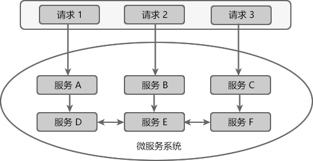
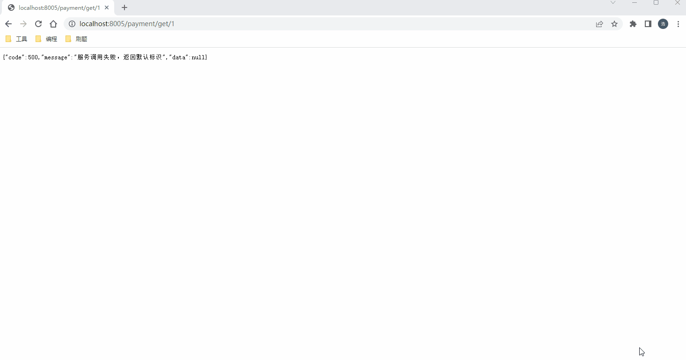

# Hystrix

document：[Home · Netflix/Hystrix Wiki (github.com)](https://github.com/Netflix/Hystrix/wiki/)

github：[https://github.com/Netflix/Hystrix](https://github.com/Netflix/Hystrix)

> 转载:[Hystrix：Spring Cloud服务熔断与降级组件（非常详细） (biancheng.net)](http://c.biancheng.net/springcloud/hystrix.html)

在微服务架构中，一个应用往往由多个服务组成，这些服务之间相互依赖，依赖关系错综复杂。

例如一个微服务系统中存在 A、B、C、D、E、F 等多个服务，它们的依赖关系如下图。




图1：服务依赖关系


通常情况下，一个用户请求往往需要多个服务配合才能完成。如图 1 所示，在所有服务都处于可用状态时，请求 1 需要调用 A、D、E、F 四个服务才能完成，请求 2 需要调用 B、E、D 三个服务才能完成，请求 3 需要调用服务 C、F、E、D 四个服务才能完成。

当服务 E 发生故障或网络延迟时，会出现以下情况：

1. 即使其他所有服务都可用，由于服务 E 的不可用，那么用户请求 1、2、3 都会处于阻塞状态，等待服务 E 的响应。在高并发的场景下，会导致整个服务器的线程资源在短时间内迅速消耗殆尽。
2. 所有依赖于服务 E 的其他服务，例如服务 B、D 以及 F 也都会处于线程阻塞状态，等待服务 E 的响应，导致这些服务的不可用。
3. 所有依赖服务B、D 和 F 的服务，例如服务 A 和服务 C 也会处于线程阻塞状态，以等待服务 D 和服务 F 的响应，导致服务 A 和服务 C 也不可用。


从以上过程可以看出，当微服务系统的一个服务出现故障时，故障会沿着服务的调用链路在系统中疯狂蔓延，最终导致整个微服务系统的瘫痪，这就是“雪崩效应”。为了防止此类事件的发生，微服务架构引入了“熔断器”的一系列服务容错和保护机制。

## 熔断器

熔断器（Circuit Breaker）一词来源物理学中的电路知识，它的作用是当线路出现故障时，迅速切断电源以保护电路的安全。

在微服务领域，熔断器最早是由 Martin Fowler 在他发表的 《[Circuit Breake](https://martinfowler.com/bliki/CircuitBreaker.html)r》一文中提出。与物理学中的熔断器作用相似，微服务架构中的熔断器能够在某个服务发生故障后，向服务调用方返回一个符合预期的、可处理的降级响应（FallBack），而不是长时间的等待或者抛出调用方无法处理的异常。这样就保证了服务调用方的线程不会被长时间、不必要地占用，避免故障在微服务系统中的蔓延，防止系统雪崩效应的发生。

## Spring Cloud Hystrix 

Spring Cloud Hystrix 是一款优秀的服务容错与保护组件，也是 Spring Cloud 中最重要的组件之一。

Spring Cloud Hystrix 是基于 Netflix 公司的开源组件 Hystrix 实现的，它提供了熔断器功能，能够有效地阻止分布式微服务系统中出现联动故障，以提高微服务系统的弹性。Spring Cloud Hystrix 具有服务降级、服务熔断、线程隔离、请求缓存、请求合并以及实时故障监控等强大功能。

> Hystrix [hɪst'rɪks]，中文含义是豪猪，豪猪的背上长满了棘刺，使它拥有了强大的自我保护能力。而 Spring Cloud Hystrix 作为一个服务容错与保护组件，也可以让服务拥有自我保护的能力，因此也有人将其戏称为“豪猪哥”。

在微服务系统中，Hystrix 能够帮助我们实现以下目标：

- **保护线程资源**：防止单个服务的故障耗尽系统中的所有线程资源。
- **快速失败机制**：当某个服务发生了故障，不让服务调用方一直等待，而是直接返回请求失败。
- **提供降级（FallBack）方案**：在请求失败后，提供一个设计好的降级方案，通常是一个兜底方法，当请求失败后即调用该方法。
- **防止故障扩散**：使用熔断机制，防止故障扩散到其他服务。
- **监控功能**：提供熔断器故障监控组件 Hystrix Dashboard，随时监控熔断器的状态。

## Hystrix 服务降级

Hystrix 提供了服务降级功能，能够保证当前服务不受其他服务故障的影响，提高服务的健壮性。

服务降级的使用场景有以下 2 种：

- 在服务器压力剧增时，根据实际业务情况及流量，对一些不重要、不紧急的服务进行有策略地不处理或简单处理，从而释放服务器资源以保证核心服务正常运作。
- 当某些服务不可用时，为了避免长时间等待造成服务卡顿或雪崩效应，而主动执行备用的降级逻辑立刻返回一个友好的提示，以保障主体业务不受影响。


我们可以通过重写 HystrixCommand 的 getFallBack() 方法或 HystrixObservableCommand 的 resumeWithFallback() 方法，使服务支持服务降级。

Hystrix 服务降级 FallBack 既可以放在服务端进行，也可以放在客户端进行。

Hystrix 会在以下场景下进行服务降级处理：

- 程序运行异常
- 服务超时
- 熔断器处于打开状态
- 线程池资源耗尽


## 程序实例


### 服务端服务降级

在主工程下创建一个名为 cloud-provider-hystrix-payment 的服务提供者，并在其 pom.xml 中添加以下依赖。

```xml
<?xml version="1.0" encoding="UTF-8"?>
<project xmlns="http://maven.apache.org/POM/4.0.0"
         xmlns:xsi="http://www.w3.org/2001/XMLSchema-instance"
         xsi:schemaLocation="http://maven.apache.org/POM/4.0.0 http://maven.apache.org/xsd/maven-4.0.0.xsd">
    <parent>
        <artifactId>code</artifactId>
        <groupId>groupId</groupId>
        <version>1.0-SNAPSHOT</version>
    </parent>
    <modelVersion>4.0.0</modelVersion>

    <groupId>com.liuhao.cloud</groupId>
    <artifactId>cloud-provider-hystrix-payment</artifactId>

    <properties>
        <maven.compiler.source>8</maven.compiler.source>
        <maven.compiler.target>8</maven.compiler.target>
    </properties>

    <dependencies>
        <dependency>
            <groupId>org.springframework.boot</groupId>
            <artifactId>spring-boot-starter-web</artifactId>
        </dependency>
        <!--hystrix 依赖-->
        <dependency>
            <groupId>org.springframework.cloud</groupId>
            <artifactId>spring-cloud-starter-netflix-hystrix</artifactId>
        </dependency>
        <dependency>
            <groupId>org.springframework.boot</groupId>
            <artifactId>spring-boot-starter-actuator</artifactId>
        </dependency>
        <!-- 服务注册中心的客户端端 eureka-client -->
        <!-- https://mvnrepository.com/artifact/org.springframework.cloud/spring-cloud-starter-eureka-server -->
        <dependency>
            <groupId>org.springframework.cloud</groupId>
            <artifactId>spring-cloud-starter-netflix-eureka-client</artifactId>
        </dependency>
        <dependency>
            <groupId>org.springframework.boot</groupId>
            <artifactId>spring-boot-starter</artifactId>
            <exclusions>
                <exclusion>
                    <artifactId>spring-boot-starter-logging</artifactId>
                    <groupId>org.springframework.boot</groupId>
                </exclusion>
            </exclusions>
        </dependency>
        <dependency>
            <groupId>org.springframework.boot</groupId>
            <artifactId>spring-boot-starter-log4j2</artifactId>
        </dependency>
        <dependency>
            <groupId>com.alibaba</groupId>
            <artifactId>druid-spring-boot-starter</artifactId>
            <version>1.2.8</version>
        </dependency>
        <dependency>
            <groupId>org.mybatis.spring.boot</groupId>
            <artifactId>mybatis-spring-boot-starter</artifactId>
        </dependency>
        <!-- https://mvnrepository.com/artifact/mysql/mysql-connector-java -->
        <dependency>
            <groupId>mysql</groupId>
            <artifactId>mysql-connector-java</artifactId>
        </dependency>
        <dependency>
            <groupId>org.projectlombok</groupId>
            <artifactId>lombok</artifactId>
            <optional>true</optional>
        </dependency>
        <dependency>
            <groupId>org.springframework.boot</groupId>
            <artifactId>spring-boot-starter-jdbc</artifactId>
        </dependency>
        <dependency>
            <groupId>com.liuhao.cloud</groupId>
            <artifactId>cloud-api-commons</artifactId>
            <version>1.0-SNAPSHOT</version>
            <scope>compile</scope>
        </dependency>
        <dependency>
            <groupId>org.apache.commons</groupId>
            <artifactId>commons-lang3</artifactId>
        </dependency>
        <dependency>
            <groupId>org.apache.commons</groupId>
            <artifactId>commons-collections4</artifactId>
        </dependency>
        <dependency>
            <groupId>com.alibaba</groupId>
            <artifactId>fastjson</artifactId>
        </dependency>
    </dependencies>
</project>
```

在类路径（即 /resources 目录）下添加一个配置文件 application.yml，配置内容如下。

```yaml
server:
  port: 8005
spring:
  application:
    name: cloud-payment-service
  datasource:
    driver-class-name: com.mysql.cj.jdbc.Driver
    type: com.alibaba.druid.pool.DruidDataSource
    username: root
    password: qazwsx123
    url: jdbc:mysql://192.168.133.10:3306/payment8001?useUnicode=true&characterEncoding=utf-8&useSSL=false
mybatis:
  mapper-locations: classpath:mapper/*.xml
  type-aliases-package: com.liuhao.cloud.commons.entity
eureka:
  client:
    register-with-eureka: true #是否向注册中心注册自己
    fetchRegistry: true #是否从注册中心抓取已有的注册信息 默认true，集群必须设置为true
    service-url:
      #      设置与eureka server交互的地址查询服务和注册服务都需要依赖这个地址
      #      defaultZone: http://localhost:7001/eureka #单机版
      defaultZone: http://eureka7001:7001/eureka
  instance:
    prefer-ip-address: true  #访问路径可以显示IP地址
    instance-id: hystrix-payment8005
    lease-renewal-interval-in-seconds: 30 #定义服务多久去注册中心续约
    lease-expiration-duration-in-seconds: 90 #定义服务多久不去续约认为服务失效
logging:
  config: classpath:log4j2.xml # 配置log4j2的配置文件 ，默认就是log4j2.xml
```


服务端接口（详细的实现类可以看项目内的cloud-provider-hystrix-payment模块，这里只展现关键代码）

我们可以看到 deptInfo_Timeout() 方法上使用 @HystrixCommand 注解，该注解说明如下：

- 参数 fallbackMethod 属性用于指定降级方法。
- 参数 execution.isolation.thread.timeoutInMilliseconds 用于设置自身调用超时时间的峰值，峰值内可以正常运行，否则执行降级方法

```java
@RequestMapping("/payment")
@RestController
public class PaymentController {

    private static Logger logger = LoggerFactory.getLogger(PaymentController.class);

    @Value("${server.port}")
    private String serverPort;

    @Autowired
    private PaymentService paymentService;

    // 设置失败的兜底犯法
    @HystrixCommand(fallbackMethod = "selectOne_fallback", commandProperties = {
        	// 设置方法超时的时间timeout属性
            @HystrixProperty(name = "execution.isolation.thread.timeoutInMilliseconds", value = "2000")
    })
    @GetMapping("get/{id}")
    public CommonResult<Payment> selectOne(@PathVariable("id") Long id) {
        Payment payment = this.paymentService.queryById(id);
        logger.info("payment :{}", payment);
        try {
            Thread.sleep(3000);
        } catch (InterruptedException e) {
            e.printStackTrace();
        }
        return new CommonResult<Payment>(200, "port:{" + serverPort + "}", payment);
    }

    @PostMapping("create")
    public CommonResult<Payment> create(@RequestBody Payment payment) {
        Payment insert = this.paymentService.insert(payment);
        logger.info("payment {} insert:", insert);
        return new CommonResult<>(200, "port:{" + serverPort + "}", insert);
    }

    @RequestMapping(method = RequestMethod.GET, value = "/uuid")
    public CommonResult<String> getUUID() {
        String uuid = UUID.randomUUID().toString();
        logger.info("uuid:{}", uuid);
        return new CommonResult<>(200, uuid, null);
    }

    public CommonResult<Payment> selectOne_fallback(Long id) {
        return new CommonResult<>(500,"服务调用失败，返回默认标识");
    }

}
```

在服务端开启对Hystrix的支持

```java
// 开启熔断器
@EnableCircuitBreaker
@EnableEurekaClient
@SpringBootApplication
public class HystrixPaymentServiceApplication {

    public static void main(String[] args) {
        SpringApplication.run(HystrixPaymentServiceApplication.class, args);
    }
}

```

启动程序通过浏览器访问localhost:8005/payment/get/1接口

