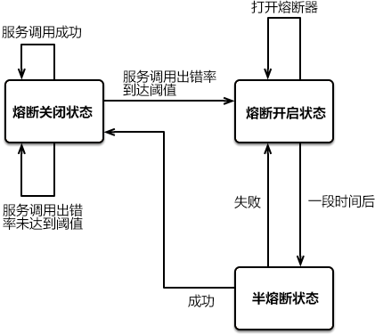

# Hystrix

document：[Home · Netflix/Hystrix Wiki (github.com)](https://github.com/Netflix/Hystrix/wiki/)

github：[https://github.com/Netflix/Hystrix](https://github.com/Netflix/Hystrix)

> 转载:[Hystrix：Spring Cloud服务熔断与降级组件（非常详细） (biancheng.net)](http://c.biancheng.net/springcloud/hystrix.html)

在微服务架构中，一个应用往往由多个服务组成，这些服务之间相互依赖，依赖关系错综复杂。

例如一个微服务系统中存在 A、B、C、D、E、F 等多个服务，它们的依赖关系如下图。


图1：服务依赖关系


通常情况下，一个用户请求往往需要多个服务配合才能完成。如图 1 所示，在所有服务都处于可用状态时，请求 1 需要调用 A、D、E、F 四个服务才能完成，请求 2 需要调用 B、E、D 三个服务才能完成，请求 3 需要调用服务 C、F、E、D 四个服务才能完成。

当服务 E 发生故障或网络延迟时，会出现以下情况：

1. 即使其他所有服务都可用，由于服务 E 的不可用，那么用户请求 1、2、3 都会处于阻塞状态，等待服务 E 的响应。在高并发的场景下，会导致整个服务器的线程资源在短时间内迅速消耗殆尽。
2. 所有依赖于服务 E 的其他服务，例如服务 B、D 以及 F 也都会处于线程阻塞状态，等待服务 E 的响应，导致这些服务的不可用。
3. 所有依赖服务B、D 和 F 的服务，例如服务 A 和服务 C 也会处于线程阻塞状态，以等待服务 D 和服务 F 的响应，导致服务 A 和服务 C 也不可用。


从以上过程可以看出，当微服务系统的一个服务出现故障时，故障会沿着服务的调用链路在系统中疯狂蔓延，最终导致整个微服务系统的瘫痪，这就是“雪崩效应”。为了防止此类事件的发生，微服务架构引入了“熔断器”的一系列服务容错和保护机制。

## 熔断器

熔断器（Circuit Breaker）一词来源物理学中的电路知识，它的作用是当线路出现故障时，迅速切断电源以保护电路的安全。

在微服务领域，熔断器最早是由 Martin Fowler 在他发表的 《[Circuit Breake](https://martinfowler.com/bliki/CircuitBreaker.html)r》一文中提出。与物理学中的熔断器作用相似，微服务架构中的熔断器能够在某个服务发生故障后，向服务调用方返回一个符合预期的、可处理的降级响应（FallBack），而不是长时间的等待或者抛出调用方无法处理的异常。这样就保证了服务调用方的线程不会被长时间、不必要地占用，避免故障在微服务系统中的蔓延，防止系统雪崩效应的发生。

## Spring Cloud Hystrix 

Spring Cloud Hystrix 是一款优秀的服务容错与保护组件，也是 Spring Cloud 中最重要的组件之一。

Spring Cloud Hystrix 是基于 Netflix 公司的开源组件 Hystrix 实现的，它提供了熔断器功能，能够有效地阻止分布式微服务系统中出现联动故障，以提高微服务系统的弹性。Spring Cloud Hystrix 具有服务降级、服务熔断、线程隔离、请求缓存、请求合并以及实时故障监控等强大功能。

> Hystrix [hɪst'rɪks]，中文含义是豪猪，豪猪的背上长满了棘刺，使它拥有了强大的自我保护能力。而 Spring Cloud Hystrix 作为一个服务容错与保护组件，也可以让服务拥有自我保护的能力，因此也有人将其戏称为“豪猪哥”。

在微服务系统中，Hystrix 能够帮助我们实现以下目标：

- **保护线程资源**：防止单个服务的故障耗尽系统中的所有线程资源。
- **快速失败机制**：当某个服务发生了故障，不让服务调用方一直等待，而是直接返回请求失败。
- **提供降级（FallBack）方案**：在请求失败后，提供一个设计好的降级方案，通常是一个兜底方法，当请求失败后即调用该方法。
- **防止故障扩散**：使用熔断机制，防止故障扩散到其他服务。
- **监控功能**：提供熔断器故障监控组件 Hystrix Dashboard，随时监控熔断器的状态。

## Hystrix 服务降级

Hystrix 提供了服务降级功能，能够保证当前服务不受其他服务故障的影响，提高服务的健壮性。

服务降级的使用场景有以下 2 种：

- 在服务器压力剧增时，根据实际业务情况及流量，对一些不重要、不紧急的服务进行有策略地不处理或简单处理，从而释放服务器资源以保证核心服务正常运作。
- 当某些服务不可用时，为了避免长时间等待造成服务卡顿或雪崩效应，而主动执行备用的降级逻辑立刻返回一个友好的提示，以保障主体业务不受影响。


我们可以通过重写 HystrixCommand 的 getFallBack() 方法或 HystrixObservableCommand 的 resumeWithFallback() 方法，使服务支持服务降级。

Hystrix 服务降级 FallBack 既可以放在服务端进行，也可以放在客户端进行。

Hystrix 会在以下场景下进行服务降级处理：

- 程序运行异常
- 服务超时
- 熔断器处于打开状态
- 线程池资源耗尽


### 程序实例


#### 服务端服务降级

在主工程下创建一个名为 cloud-provider-hystrix-payment 的服务提供者，并在其 pom.xml 中添加以下依赖。

```xml
<?xml version="1.0" encoding="UTF-8"?>
<project xmlns="http://maven.apache.org/POM/4.0.0"
         xmlns:xsi="http://www.w3.org/2001/XMLSchema-instance"
         xsi:schemaLocation="http://maven.apache.org/POM/4.0.0 http://maven.apache.org/xsd/maven-4.0.0.xsd">
    <parent>
        <artifactId>code</artifactId>
        <groupId>groupId</groupId>
        <version>1.0-SNAPSHOT</version>
    </parent>
    <modelVersion>4.0.0</modelVersion>

    <groupId>com.liuhao.cloud</groupId>
    <artifactId>cloud-provider-hystrix-payment</artifactId>

    <properties>
        <maven.compiler.source>8</maven.compiler.source>
        <maven.compiler.target>8</maven.compiler.target>
    </properties>

    <dependencies>
        <dependency>
            <groupId>org.springframework.boot</groupId>
            <artifactId>spring-boot-starter-web</artifactId>
        </dependency>
        <!--hystrix 依赖-->
        <dependency>
            <groupId>org.springframework.cloud</groupId>
            <artifactId>spring-cloud-starter-netflix-hystrix</artifactId>
        </dependency>
        <dependency>
            <groupId>org.springframework.boot</groupId>
            <artifactId>spring-boot-starter-actuator</artifactId>
        </dependency>
        <!-- 服务注册中心的客户端端 eureka-client -->
        <!-- https://mvnrepository.com/artifact/org.springframework.cloud/spring-cloud-starter-eureka-server -->
        <dependency>
            <groupId>org.springframework.cloud</groupId>
            <artifactId>spring-cloud-starter-netflix-eureka-client</artifactId>
        </dependency>
        <dependency>
            <groupId>org.springframework.boot</groupId>
            <artifactId>spring-boot-starter</artifactId>
            <exclusions>
                <exclusion>
                    <artifactId>spring-boot-starter-logging</artifactId>
                    <groupId>org.springframework.boot</groupId>
                </exclusion>
            </exclusions>
        </dependency>
        <dependency>
            <groupId>org.springframework.boot</groupId>
            <artifactId>spring-boot-starter-log4j2</artifactId>
        </dependency>
        <dependency>
            <groupId>com.alibaba</groupId>
            <artifactId>druid-spring-boot-starter</artifactId>
            <version>1.2.8</version>
        </dependency>
        <dependency>
            <groupId>org.mybatis.spring.boot</groupId>
            <artifactId>mybatis-spring-boot-starter</artifactId>
        </dependency>
        <!-- https://mvnrepository.com/artifact/mysql/mysql-connector-java -->
        <dependency>
            <groupId>mysql</groupId>
            <artifactId>mysql-connector-java</artifactId>
        </dependency>
        <dependency>
            <groupId>org.projectlombok</groupId>
            <artifactId>lombok</artifactId>
            <optional>true</optional>
        </dependency>
        <dependency>
            <groupId>org.springframework.boot</groupId>
            <artifactId>spring-boot-starter-jdbc</artifactId>
        </dependency>
        <dependency>
            <groupId>com.liuhao.cloud</groupId>
            <artifactId>cloud-api-commons</artifactId>
            <version>1.0-SNAPSHOT</version>
            <scope>compile</scope>
        </dependency>
        <dependency>
            <groupId>org.apache.commons</groupId>
            <artifactId>commons-lang3</artifactId>
        </dependency>
        <dependency>
            <groupId>org.apache.commons</groupId>
            <artifactId>commons-collections4</artifactId>
        </dependency>
        <dependency>
            <groupId>com.alibaba</groupId>
            <artifactId>fastjson</artifactId>
        </dependency>
    </dependencies>
</project>
```

在类路径（即 /resources 目录）下添加一个配置文件 application.yml，配置内容如下。

```yaml
server:
  port: 8005
spring:
  application:
    name: cloud-payment-service
  datasource:
    driver-class-name: com.mysql.cj.jdbc.Driver
    type: com.alibaba.druid.pool.DruidDataSource
    username: root
    password: qazwsx123
    url: jdbc:mysql://192.168.133.10:3306/payment8001?useUnicode=true&characterEncoding=utf-8&useSSL=false
mybatis:
  mapper-locations: classpath:mapper/*.xml
  type-aliases-package: com.liuhao.cloud.commons.entity
eureka:
  client:
    register-with-eureka: true #是否向注册中心注册自己
    fetchRegistry: true #是否从注册中心抓取已有的注册信息 默认true，集群必须设置为true
    service-url:
      #      设置与eureka server交互的地址查询服务和注册服务都需要依赖这个地址
      #      defaultZone: http://localhost:7001/eureka #单机版
      defaultZone: http://eureka7001:7001/eureka
  instance:
    prefer-ip-address: true  #访问路径可以显示IP地址
    instance-id: hystrix-payment8005
    lease-renewal-interval-in-seconds: 30 #定义服务多久去注册中心续约
    lease-expiration-duration-in-seconds: 90 #定义服务多久不去续约认为服务失效
logging:
  config: classpath:log4j2.xml # 配置log4j2的配置文件 ，默认就是log4j2.xml
```


服务端接口（详细的实现类可以看项目内的cloud-provider-hystrix-payment模块，这里只展现关键代码）

我们可以看到 deptInfo_Timeout() 方法上使用 @HystrixCommand 注解，该注解说明如下：

- 参数 fallbackMethod 属性用于指定降级方法。
- 参数 execution.isolation.thread.timeoutInMilliseconds 用于设置自身调用超时时间的峰值，峰值内可以正常运行，否则执行降级方法

```java
@RequestMapping("/payment")
@RestController
public class PaymentController {

    private static Logger logger = LoggerFactory.getLogger(PaymentController.class);

    @Value("${server.port}")
    private String serverPort;

    @Autowired
    private PaymentService paymentService;

    // 设置失败的兜底犯法
    @HystrixCommand(fallbackMethod = "selectOne_fallback", commandProperties = {
        	// 设置方法超时的时间timeout属性
            @HystrixProperty(name = "execution.isolation.thread.timeoutInMilliseconds", value = "2000")
    })
    @GetMapping("get/{id}")
    public CommonResult<Payment> selectOne(@PathVariable("id") Long id) {
        Payment payment = this.paymentService.queryById(id);
        logger.info("payment :{}", payment);
        try {
            Thread.sleep(3000);
        } catch (InterruptedException e) {
            e.printStackTrace();
        }
        return new CommonResult<Payment>(200, "port:{" + serverPort + "}", payment);
    }

    @PostMapping("create")
    public CommonResult<Payment> create(@RequestBody Payment payment) {
        Payment insert = this.paymentService.insert(payment);
        logger.info("payment {} insert:", insert);
        return new CommonResult<>(200, "port:{" + serverPort + "}", insert);
    }

    @RequestMapping(method = RequestMethod.GET, value = "/uuid")
    public CommonResult<String> getUUID() {
        String uuid = UUID.randomUUID().toString();
        logger.info("uuid:{}", uuid);
        return new CommonResult<>(200, uuid, null);
    }

    public CommonResult<Payment> selectOne_fallback(Long id) {
        return new CommonResult<>(500,"服务调用失败，返回默认标识");
    }

}
```

在服务端开启对Hystrix的支持

```java
// 开启熔断器
@EnableCircuitBreaker
@EnableEurekaClient
@SpringBootApplication
public class HystrixPaymentServiceApplication {

    public static void main(String[] args) {
        SpringApplication.run(HystrixPaymentServiceApplication.class, args);
    }
}

```

启动程序通过浏览器访问localhost:8005/payment/get/1接口


#### 全局降级方法

通过上面的方式实现服务降级时，需要针对所有业务方法都配置降级方法，这极有可能会造成代码的急剧膨胀。为了解决该问题，我们还可以为所有业务方法指定一个全局的回退方法，具体步骤如下。

在服务端controller的类名上标注 @DefaultProperties 注解，并通过其 defaultFallback 属性指定一个全局的降级方法，代码如下。

```java
@Slf4j
@RestController
@DefaultProperties(defaultFallback = "dept_Global_FallbackMethod") //全局的服务降级方法
public class HystrixController_Consumer {
	
    
    // 给请求方法设置了服务降级，但是没指定具体参数，因此当发生服务降级时，会走全局设置的默认方法
	@RequestMapping(value = "/dept/hystrix/timeout/{id}")
	@HystrixCommand
	public String deptInfo_Timeout(@PathVariable("id") Integer id) {
    	String s = deptHystrixService.deptInfo_Timeout(id);
    	log.info(s);
    	return s;
	}
    
    
    /**
	 * 全局的 fallback 方法，
 	 * 回退方法必须和 hystrix 的执行方法在相同类中
 	 * @DefaultProperties(defaultFallback = "dept_Global_FallbackMethod") 类上注解，请求方法上使用 @HystrixCommand 注解
 	 */
	public String dept_Global_FallbackMethod() {
    	return "C语言中文网提醒您，运行出错或服务端系统繁忙，请稍后再试！（客户端全局回退方法触发,）";
	}
    
}
```


#### 客户端降级

> 通常情况下，我们都会在客户端进行服务降级，当客户端调用的服务端的服务不可用时，客户端直接进行服务降级处理，避免其线程被长时间、不必要地占用。


1.在 cloud-hystrix-consumer-order80 的 pom.xml 中添加 Hystrix 的依赖，代码如下。

```xml
<!--hystrix 依赖-->
<dependency>
    <groupId>org.springframework.cloud</groupId>
    <artifactId>spring-cloud-starter-netflix-hystrix</artifactId>
</dependency>
```

在主启动类上开启Hystrix的支持

```java
@EnableHystrix // 开启Hystrix
@EnableFeignClients // 开启FeignClient
@EnableDiscoveryClient
@SpringBootApplication
public class HystrixConsumer80Application {

    public static void main(String[] args) {
        SpringApplication.run(HystrixConsumer80Application.class, args);
    }
}

```

2.在 cloud-hystrix-consumer-order80 的 application.yml 中添加以下配置，开启客户端的 Hystrix 功能。

```yaml
# 完整的配置可以看相应的模块，这里只展示关键代码
feign:
  hystrix:
    enabled: true #开启客户端 hystrix
ribbon:
  ReadTimeout: 2000 #建立连接所用的时间，适用于网络状况正常的情况下，两端两端连接所用的时间
  ConnectionTimeout: 2000 #建立连接后，服务器读取到可用资源的时间
######################配置请求超时时间##########################
hystrix:
  command:
    default:
      execution:
        isolation:
          thread:
            timeoutInMilliseconds: 2000
```

<font color="#31b1ef">注意这里的配置其实是配合openFeign来实现的服务降级</font>


3.在 cloud-hystrix-consumer-order80 包下，创建一个名为 DeptHystrixService 的服务绑定接口，与 cloud-provider-hystrix-payment 中提供的服务接口进行绑定，代码如下。

```java
import com.liuhao.cloud.commons.entity.CommonResult;
import com.liuhao.cloud.commons.entity.Payment;
import com.liuhao.cloud.consumer.service.impl.PaymentServiceFallbackImpl;
import org.springframework.cloud.openfeign.FeignClient;
import org.springframework.stereotype.Component;
import org.springframework.web.bind.annotation.PathVariable;
import org.springframework.web.bind.annotation.RequestBody;
import org.springframework.web.bind.annotation.RequestMapping;
import org.springframework.web.bind.annotation.RequestMethod;

@Component
// 通过fallback属性为服务的每个接口设置兜底方法
@FeignClient(value = "cloud-payment-service", fallback = PaymentServiceFallbackImpl.class)
public interface PaymentService {

    @RequestMapping(method = RequestMethod.GET, value = "/payment/uuid")
    CommonResult<String> getUUID();

    @RequestMapping(method = RequestMethod.POST, value = "/payment/create")
    CommonResult<Payment> create(@RequestBody Payment payment);

    @RequestMapping(method = RequestMethod.GET, value = "/payment/get/{id}")
    CommonResult<Payment> selectOne(@PathVariable("id") Long id);

}

```


PaymentServiceFallbackImpl的实现

```java
/**
 * feign 配合 hystrix在服务层面上通过接口实现的方式实现fallback兜底
 **/
@Component
public class PaymentServiceFallbackImpl implements PaymentService {


    @Override
    public CommonResult<String> getUUID() {
        return new CommonResult<>("com.liuhao.cloud.consumer.service.impl.PaymentService.getUUID fallback");
    }

    @Override
    public CommonResult<Payment> create(Payment payment) {
        return new CommonResult<>("com.liuhao.cloud.consumer.service.impl.PaymentService.create fallback");
    }

    @Override
    public CommonResult<Payment> selectOne(Long id) {
        return new CommonResult<>("com.liuhao.cloud.consumer.service.impl.PaymentService.selectOne fallback");
    }
}
```


4.cloud-provider-hystrix-payment 中提供的服务接口如下：

```java
import com.liuhao.cloud.commons.entity.CommonResult;
import com.liuhao.cloud.commons.entity.Payment;
import com.liuhao.cloud.service.PaymentService;
import com.netflix.hystrix.contrib.javanica.annotation.HystrixCommand;
import com.netflix.hystrix.contrib.javanica.annotation.HystrixProperty;
import org.slf4j.Logger;
import org.slf4j.LoggerFactory;
import org.springframework.beans.factory.annotation.Autowired;
import org.springframework.beans.factory.annotation.Value;
import org.springframework.web.bind.annotation.*;

import java.util.UUID;

@RequestMapping("/payment")
@RestController
public class PaymentController {

    private static Logger logger = LoggerFactory.getLogger(PaymentController.class);

    @Value("${server.port}")
    private String serverPort;

    @Autowired
    private PaymentService paymentService;

    // 设置失败的兜底犯法，设置方法超时的时间timeout属性
    @HystrixCommand(fallbackMethod = "selectOne_fallback", commandProperties = {
            @HystrixProperty(name = "execution.isolation.thread.timeoutInMilliseconds", value = "3000")
    })
    @GetMapping("get/{id}")
    public CommonResult<Payment> selectOne(@PathVariable("id") Long id) {
        Payment payment = this.paymentService.queryById(id);
        logger.info("payment :{}", payment);
        try {
            Thread.sleep(4000);
        } catch (InterruptedException e) {
            e.printStackTrace();
        }
        return new CommonResult<Payment>(200, "port:{" + serverPort + "}", payment);
    }

    @PostMapping("create")
    public CommonResult<Payment> create(@RequestBody Payment payment) {
        Payment insert = this.paymentService.insert(payment);
        logger.info("payment {} insert:", insert);
        return new CommonResult<>(200, "port:{" + serverPort + "}", insert);
    }

    @RequestMapping(method = RequestMethod.GET, value = "/uuid")
    public CommonResult<String> getUUID() {
        String uuid = UUID.randomUUID().toString();
        logger.info("uuid:{}", uuid);
        return new CommonResult<>(200, uuid, null);
    }

    public CommonResult<Payment> selectOne_fallback(Long id) {
        return new CommonResult<>(500,"服务调用失败，返回默认标识");
    }

}
```

5.在cloud-hystrix-consumer-order80的配置文件中为服务设置全局的超时时间不超过1000

注意服务端/payment/get/{id}接口的超时时间上限为3秒但是接口耗时为4秒，而客户端的超时设置为只允许1秒，超过1秒既视为放弃


测试结果

客户端设置最长超时时间为2秒，很明显服务端的耗时超过了预期，所以在2000后客户端就自动选择走设置的兜底方法


## Hystrix 服务熔断

熔断机制是为了应对雪崩效应而出现的一种微服务链路保护机制。

当微服务系统中的某个微服务不可用或响应时间太长时，为了保护系统的整体可用性，熔断器会暂时切断请求对该服务的调用，并快速返回一个友好的错误响应。这种熔断状态不是永久的，在经历了一定的时间后，熔断器会再次检测该微服务是否恢复正常，若服务恢复正常则恢复其调用链路。

#### 熔断状态

在熔断机制中涉及了三种熔断状态：

- 熔断关闭状态（Closed）：当服务访问正常时，熔断器处于关闭状态，服务调用方可以正常地对服务进行调用。
- 熔断开启状态（Open）：默认情况下，在固定时间内接口调用出错比率达到一个阈值（例如 50%），熔断器会进入熔断开启状态。进入熔断状态后，后续对该服务的调用都会被切断，熔断器会执行本地的降级（FallBack）方法。
- 半熔断状态（Half-Open）： 在熔断开启一段时间之后，熔断器会进入半熔断状态。在半熔断状态下，熔断器会尝试恢复服务调用方对服务的调用，允许部分请求调用该服务，并监控其调用成功率。如果成功率达到预期，则说明服务已恢复正常，熔断器进入关闭状态；如果成功率仍旧很低，则重新进入熔断开启状态。


三种熔断状态之间的转化关系如下图：

	

#### Hystrix 实现熔断机制

在 Spring Cloud 中，熔断机制是通过 Hystrix 实现的。Hystrix 会监控微服务间调用的状况，当失败调用到一定比例时（例如 5 秒内失败 20 次），就会启动熔断机制。

Hystrix 实现服务熔断的步骤如下：

1. 当服务的调用出错率达到或超过 Hystix 规定的比率（默认为 50%）后，熔断器进入熔断开启状态。
2. 熔断器进入熔断开启状态后，Hystrix 会启动一个休眠时间窗，在这个时间窗内，该服务的降级逻辑会临时充当业务主逻辑，而原来的业务主逻辑不可用。
3. 当有请求再次调用该服务时，会直接调用降级逻辑快速地返回失败响应，以避免系统雪崩。
4. 当休眠时间窗到期后，Hystrix 会进入半熔断转态，允许部分请求对服务原来的主业务逻辑进行调用，并监控其调用成功率。
5. 如果调用成功率达到预期，则说明服务已恢复正常，Hystrix 进入熔断关闭状态，服务原来的主业务逻辑恢复；否则 Hystrix 重新进入熔断开启状态，休眠时间窗口重新计时，继续重复第 2 到第 5 步。


程序案例

在服务端cloud-provider-hystrix-payment里面给某一个接口设置熔断机制

```java
@RequestMapping("/payment")
@RestController
@DefaultProperties(defaultFallback = "default_fallback_method")
public class PaymentController {

    private static Logger logger = LoggerFactory.getLogger(PaymentController.class);

    @Value("${server.port}")
    private String serverPort;

    @Autowired
    private PaymentService paymentService;

    // 为当前方法设置熔断机制，允许开启熔断器，当2秒内10次请求失败了6次则视为当前接口失效，直接走降级方法的逻辑
    // 窗口期为10秒，当熔断器开启后10秒自动重试，如果2秒10次请求失败小于6次则视为接口已恢复
    // 注意：在10秒的窗口期内，就算发送是正确请求，也会因为熔断器的开启，返回默认的fallback_method
    @HystrixCommand(fallbackMethod = "selectOne_fallback", commandProperties = {
            @HystrixProperty(name = "circuitBreaker.enabled", value = "true"), //是否开启熔断器
            @HystrixProperty(name = "metrics.rollingStats.timeInMilliseconds", value = "2000"), //统计时间窗
            @HystrixProperty(name = "circuitBreaker.requestVolumeThreshold", value = "10"), //统计时间窗内请求次数
            @HystrixProperty(name = "circuitBreaker.sleepWindowInMilliseconds", value = "10000"), //休眠时间窗口期
            @HystrixProperty(name = "circuitBreaker.errorThresholdPercentage", value = "60"), //在统计时间窗口期以内，请求失败率达到 60% 时进入熔断状态)
    })
    @GetMapping("get/{id}")
    public CommonResult<Payment> selectOne(@PathVariable("id") Long id) {
        if (id <= 0) {
            // 当id为负数时，抛出异常，触发降级
            throw new RuntimeException("id 必须大于0");
        }
        Payment payment = this.paymentService.queryById(id);
        logger.info("payment :{}", payment);
        return new CommonResult<Payment>(200, "port:{" + serverPort + "}", payment);
    }

    @PostMapping("create")
    public CommonResult<Payment> create(@RequestBody Payment payment) {
        Payment insert = this.paymentService.insert(payment);
        logger.info("payment {} insert:", insert);
        return new CommonResult<>(200, "port:{" + serverPort + "}", insert);
    }

    @HystrixCommand
    @RequestMapping(method = RequestMethod.GET, value = "/uuid")
    public CommonResult<String> getUUID() {
        String uuid = UUID.randomUUID().toString();
        int a = 10 / 0;
        logger.info("uuid:{}", uuid);
        return new CommonResult<>(200, uuid, null);
    }

    public CommonResult<Payment> selectOne_fallback(Long id) {
        return new CommonResult<>(500, "服务调用失败，返回默认标识");
    }

    public CommonResult<String> default_fallback_method() {
        return new CommonResult<>("当前接口没有设置降级方法，因此使用默认降级方法");
    }

}

```


测试

我们会发现当在窗口期内，失败次数大于设置的百分比，熔断器就会处于打开的状态，之后我们就算发送正确请求也还是会走兜底的方法，当过了一段时间后，接口才恢复正常


## Hystrix 故障监控

Hystrix 还提供了准实时的调用监控（Hystrix Dashboard）功能，Hystrix 会持续地记录所有通过 Hystrix 发起的请求的执行信息，并以统计报表的形式展示给用户，包括每秒执行请求的数量、成功请求的数量和失败请求的数量等。

下面我们就通过一个实例来搭建 Hystrix Dashboard，监控 cloud-provider-hystrix-payment 的运行情况

在父工程下面创建一个新的模块cloud-hystrix-dashboard

maven相关依赖如下

```xml
<dependencies>
        <dependency>
            <groupId>org.springframework.boot</groupId>
            <artifactId>spring-boot-starter-web</artifactId>
        </dependency>
        <!--hystrix监控模块-->
        <dependency>
            <groupId>org.springframework.cloud</groupId>
            <artifactId>spring-cloud-starter-netflix-hystrix-dashboard</artifactId>
        </dependency>
        <!--springboot监控模块-->
        <dependency>
            <groupId>org.springframework.boot</groupId>
            <artifactId>spring-boot-starter-actuator</artifactId>
        </dependency>
        <dependency>
            <groupId>org.springframework.boot</groupId>
            <artifactId>spring-boot-starter</artifactId>
            <exclusions>
                <exclusion>
                    <artifactId>spring-boot-starter-logging</artifactId>
                    <groupId>org.springframework.boot</groupId>
                </exclusion>
            </exclusions>
        </dependency>
        <dependency>
            <groupId>org.springframework.boot</groupId>
            <artifactId>spring-boot-starter-log4j2</artifactId>
        </dependency>
    </dependencies>
```

配置文件如下：

```java
spring:
  application:
    name: cloud-hystrix-dashboard
server:
  port: 9001
hystrix:
  dashboard:
    proxy-stream-allow-list:
      - "localhost"
logging:
  config: classpath:log4j2.xml # 配置log4j2的配置文件 ，默认就是log4j2.xml
```

启动类

```java
// 开启hystixdashboard监控面板
@EnableHystrixDashboard
@SpringBootApplication
public class HystrixDashboardStartApplication {

    public static void main(String[] args) {
        SpringApplication.run(HystrixDashboardStartApplication.class, args);
    }

}
```

启动项目访问localhost:9001/hystrix，出现如下页面就算启动成功


在需要被监控的模块中加入如下配置，在本例中需要被监控的模块是：cloud-provider-hystrix-payment

```java
package net.biancheng.c.config;

import com.netflix.hystrix.contrib.metrics.eventstream.HystrixMetricsStreamServlet;
import org.springframework.boot.web.servlet.ServletRegistrationBean;
import org.springframework.context.annotation.Bean;
import org.springframework.context.annotation.Configuration;

@Configuration
public class HystrixDashboardConfig {
    /**
     *  Hystrix dashboard 监控界面必须配置
     * @return
     */
    @Bean
    public ServletRegistrationBean getServlet() {
        HystrixMetricsStreamServlet streamServlet = new HystrixMetricsStreamServlet();
        ServletRegistrationBean registrationBean = new ServletRegistrationBean(streamServlet);
        registrationBean.setLoadOnStartup(1);
        registrationBean.addUrlMappings("/actuator/hystrix.stream");//访问路径
        registrationBean.setName("hystrix.stream");
        return registrationBean;
    }

}
```


在监控页面中输入被监控模块暴露的网址


> 这个界面内的指标详情，可以去网上查查，图上只说明了常用的指标