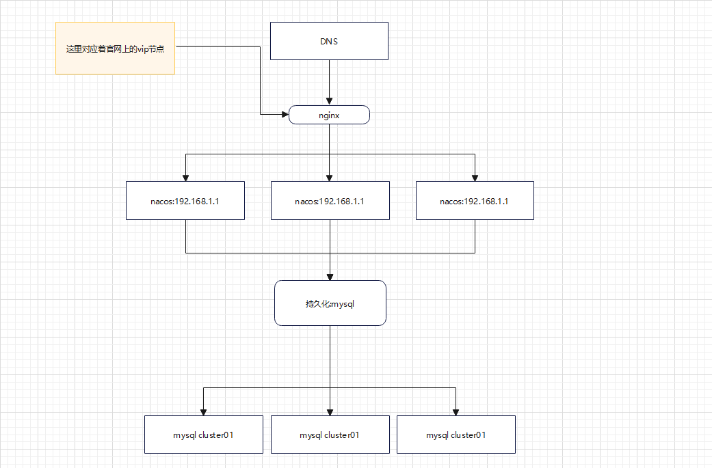

# Nacos

## Nacos的官网

[什么是 Nacos](https://nacos.io/zh-cn/docs/what-is-nacos.html)

## Nacos作为注册中心

[Nacos Spring Cloud 快速开始](https://nacos.io/zh-cn/docs/quick-start-spring-cloud.html)

## Nacos作为配置中心

[(24条消息) Nacos配置中心用法详细介绍_张维鹏的博客-CSDN博客](https://blog.csdn.net/a745233700/article/details/122916208)

## Nacos的集群配置

[集群部署说明 (nacos.io)](https://nacos.io/zh-cn/docs/v2/guide/admin/cluster-mode-quick-start.html)

 