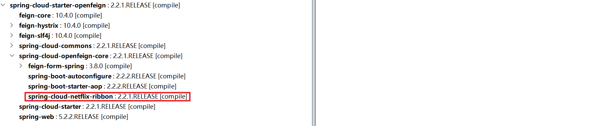

# openFeign

:rocket:[openFeign官方链接，点击即可跳转（阅读官网体验更好）](https://docs.spring.io/spring-cloud-openfeign/docs/current/reference/html/#spring-cloud-feign)


## 介绍


Feign是一个声明性web服务客户端。它使编写web服务客户端更容易。要使用Feign，请创建一个接口并对其进行注释。它具有可插入的注释支持，包括Feign注释和JAX-RS注释。Feign还支持可插拔编码器和解码器。SpringCloud添加了对SpringMVC注释的支持，并支持使用SpringWeb中默认使用的相同HttpMessageConverter。Spring Cloud集成了Eureka、Spring Cloud CircuitBreaker以及Spring Cloud LoadBalancer，以在使用Feign时提供负载平衡的http客户端。

> 上述描述是来自spring的官网翻译


## feign和openfeign的区别

- 他们底层都是内置了Ribbon，去调用注册中心的服务。
- Feign是Netflix公司写的，是SpringCloud组件中的一个轻量级RESTful的HTTP服务客户端，是SpringCloud中的第一代负载均衡客户端。OpenFeign是SpringCloud自己研发的，在Feign的基础上支持了Spring MVC的注解，如@RequesMapping等等。是SpringCloud中的第二代负载均衡客户端。
- Feign本身不支持Spring MVC的注解，使用Feign的注解定义接口，调用这个接口，就可以调用服务注册中心的服务
- OpenFeign的@FeignClient可以解析SpringMVC的@RequestMapping注解下的接口，并通过动态代理的方式产生实现类，实现类中做负载均衡并调用其他服务。


> 说人话：就是spring在Feign的基础上做了二次开发加强，与spring的耦合度更好，openFeign支持springMVC的注解，Feign不支持


## maven坐标

```xml
<dependency>
    <groupId>org.springframework.cloud</groupId>
    <artifactId>spring-cloud-starter-openfeign</artifactId>
</dependency>
```


## Include Feign

```java
@SpringBootApplication
@EnableFeignClients
public class Application {

    public static void main(String[] args) {
        SpringApplication.run(Application.class, args);
    }

}
```


## 使用openFeign调用注册中心的服务


> 下面的案例可以看官网


1.现有eureka端口7001,里面已经注册了payment服务


2.payment向外提供的服务

```java
@RequestMapping("/payment")
@RestController
public class PaymentController {

    private static Logger logger = LoggerFactory.getLogger(PaymentController.class);

    @Value("${server.port}")
    private String serverPort;

    @Autowired
    private PaymentService paymentService;
	
    // get方式根据ID获取实体信息
    @GetMapping("get/{id}")
    public CommonResult<Payment> selectOne(@PathVariable("id") Long id) {
        Payment payment = this.paymentService.queryById(id);
        logger.info("payment :{}", payment);
        return new CommonResult<Payment>(200, "port:{" + serverPort + "}", payment);
    }

    // post方式创建一条实体信息
    @PostMapping("create")
    public CommonResult<Payment> create(@RequestBody Payment payment) {
        Payment insert = this.paymentService.insert(payment);
        logger.info("payment {} insert:", insert);
        return new CommonResult<>(200, "port:{" + serverPort + "}", insert);
    }
	
    // get方式获取一个uuid
    @RequestMapping(method = RequestMethod.GET,value = "/uuid")
    public CommonResult<String> getUUID() {
        String uuid = UUID.randomUUID().toString();
        logger.info("uuid:{}", uuid);
        return new CommonResult<>(200, uuid, null);
    }

}
```


3.在客户端（order模块）使用openFeign创建代理服务

```java
@Component
// FeignClient注解的值是需要调用的微服务名称，可以在注册中心找到对于微服务的名称
@FeignClient("cloud-payment-service")
public interface PaymentService {

    @RequestMapping(method = RequestMethod.GET, value = "/payment/uuid")
    CommonResult<String> getUUID();

    @RequestMapping(method = RequestMethod.POST, value = "/payment/create")
    CommonResult<Payment> create(@RequestBody Payment payment);

    @RequestMapping(method = RequestMethod.GET, value = "/payment/get/{id}")
    CommonResult<Payment> selectOne(@PathVariable("id") Long id);
}
```


创建openFeigncontroller测试

```java
@RequestMapping("/order/openFeign")
@RestController
public class OpenFeignController {

    private static Logger logger = LoggerFactory.getLogger(OpenFeignController.class);

    @Autowired
    private PaymentService paymentService;

    @RequestMapping(method = RequestMethod.GET, value = "/uuid")
    public CommonResult<String> getUUID() {
        CommonResult<String> result = paymentService.getUUID();
        logger.info("uuid:{}", result.getMessage());
        return new CommonResult<>(200, result.getMessage(), null);
    }

    @PostMapping("create")
    public CommonResult<Payment> create(@RequestBody Payment payment) {
        CommonResult<Payment> res = paymentService.create(payment);
        logger.info(res.toString());
        return res;
    }

    @GetMapping("get/{id}")
    public CommonResult<Payment> selectOne(@PathVariable("id") Long id) {
        CommonResult<Payment> res = paymentService.selectOne(id);
        logger.info(res.toString());
        return res;
    }
}
```

有兴趣可以看当前项目下的cloud-consumer-openfeign-order80模块，上述案例都是成功案例


## 日志打印

[https://docs.spring.io/spring-cloud-openfeign/docs/current/reference/html/#feign-logging](https://docs.spring.io/spring-cloud-openfeign/docs/current/reference/html/#feign-logging)


## 超时设置

我们可以在默认客户端和命名客户端上配置超时。OpenFeign使用两个超时参数：

connectTimeout防止由于服务器处理时间过长而阻塞调用者。

readTimeout从连接建立时开始应用，并在返回响应时间过长时触发。

```yaml
ribbon:
  ReadTimeout: 1000
  ConnectTimeout: 1000
```


> 因为openFeign内置引用了ribbon来做服务调用，所以调整readTimeout,connectTime其实就调整的是ribbon的设置

