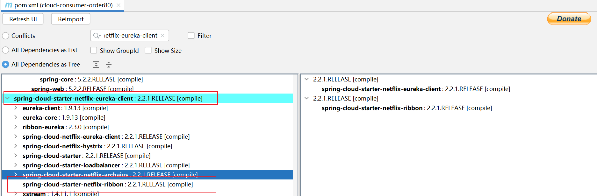
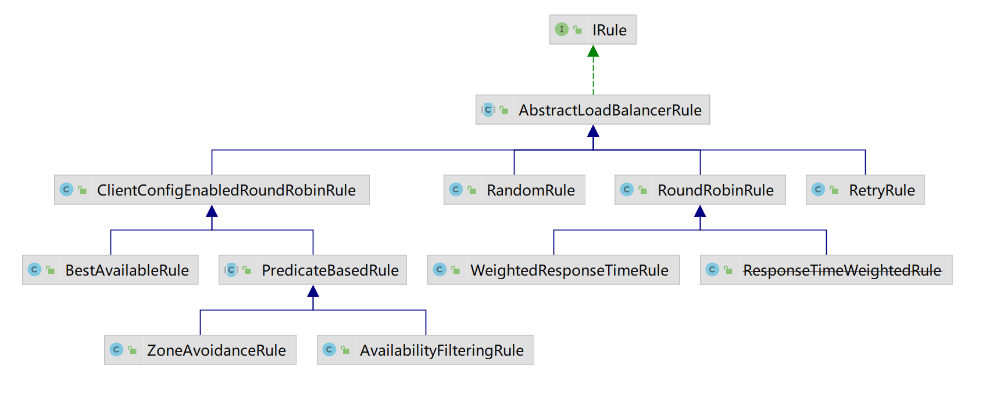

## 介绍

在微服务架构中，很多服务都会部署多个，其他服务去调用该服务的时候，如何保证负载均衡是个不得不去考虑的问题。负载均衡可以增加系统的可用性和扩展性，当我们使用[RestTemplate](https://github.com/cn2770345524/study-cloud/blob/master/files/RestTemplate工具类.md)来调用其他服务时，Ribbon可以很方便的实现负载均衡功能。

例如注册中eureka就默认使用的ribbon来实现调用微服务的负载均衡

> 当同一个微服务名下，有多个服务提供者，ribbon负载均衡就是用来选择具体是那一台微服务提供者提供服务


## maven坐标


```xml
<dependency>
   <groupId>org.springframework.cloud</groupId>
   <artifactId>spring-cloud-starter-netflix-ribbon</artifactId>
</dependency>
```

maven:eureka-client包内就内置对ribbon的应用，也就是说如果使用eureka作为注册中心，则无需显式在pom文件中映入ribbon的坐标了




## ribbon常用的负载均衡算法

ribbon内所有的负载均衡算法均通过实现`com.netflix.loadbalancer.IRule`接口来作用在程序内，默认使用的是RoundRobinRule（轮询）负载均衡算法，当然有需要时也可自定义负载均衡算法，只需要实现IRule接口即可



RoundRobinRule（轮询策略）：按照一定的顺序依次调用服务实例。多个服务轮流访问。它是Ribbon默认的负载均衡规则。
RandomRule（随机策略）：从服务提供者的列表中随机选择一个服务实例。
WeightedResponseTimeRule（权重策略）：根据每个服务提供者的响应时间分配⼀个权重，响应时间越长，权重越小，被选中的可能性也就越低。
RetryRule（重试策略）：按照轮询策略来获取服务，如果获取的服务实例为 null 或已经失效，则在指定的时间之内不断地进行重试来获取服务，如果超过指定时间依然没获取到服务实例则返回 null。
AvailabilityFilteringRule（可⽤敏感性策略）：先过滤掉⾮健康的服务实例，然后再选择连接数较⼩的服务实例。
ZoneAvoidanceRule（区域敏感策略）：根据服务所在区域（zone）的性能和服务的可⽤性来选择服务实例，在没有区域的环境下，该策略和轮询策略类似。
BestAvailableRule（最小连接数策略）：也叫最小并发数策略，它是遍历服务提供者列表，选取连接数最小的⼀个服务实例。如果有相同的最⼩连接数，那么会调⽤轮询策略进行选取。即忽略那些短路的服务器，并选择并发数较低的服务器。


## **替换负载均衡算法，使用自定义算法**

类MyLoadBalanceRule

```java
// AbstractLoadBalancerRule类实现了IRule接口，注意看上面类图
public class MyLoadBalanceRule extends AbstractLoadBalancerRule {

    private static Logger log = LoggerFactory.getLogger(MyLoadBalanceRule.class);

    private AtomicInteger nextServerCyclicCounter;

    public MyLoadBalanceRule() {
        nextServerCyclicCounter = new AtomicInteger(0);
    }

    public MyLoadBalanceRule(ILoadBalancer lb) {
        this();
        setLoadBalancer(lb);
    }

    public Server choose(ILoadBalancer lb, Object key) {
        log.info("com.liuhao.cloud.ribbon.settings.MyLoadBalanceRule.choose method:{}",key);
        if (lb == null) {
            log.warn("no load balancer");
            return null;
        }

        Server server = null;
        int count = 0;
        while (server == null && count++ < 10) {
            List<Server> reachableServers = lb.getReachableServers();
            List<Server> allServers = lb.getAllServers();
            int upCount = reachableServers.size();
            int serverCount = allServers.size();

            if ((upCount == 0) || (serverCount == 0)) {
                log.warn("No up servers available from load balancer: " + lb);
                return null;
            }

            int nextServerIndex = incrementAndGetModulo(serverCount);
            server = allServers.get(nextServerIndex);

            if (server == null) {
                /* Transient. */
                Thread.yield();
                continue;
            }

            if (server.isAlive() && (server.isReadyToServe())) {
                return (server);
            }

            // Next.
            server = null;
        }

        if (count >= 10) {
            log.warn("No available alive servers after 10 tries from load balancer: "
                    + lb);
        }
        return server;
    }

    /**
     * Inspired by the implementation of {@link AtomicInteger#incrementAndGet()}.
     *
     * @param modulo The modulo to bound the value of the counter.
     * @return The next value.
     */
    private int incrementAndGetModulo(int modulo) {
        for (; ; ) {
            int current = nextServerCyclicCounter.get();
            int next = (current + 1) % modulo;
            if (nextServerCyclicCounter.compareAndSet(current, next)) {
                return next;
            }
        }
    }

    @Override
    public void initWithNiwsConfig(IClientConfig iClientConfig) {

    }

    @Override
    public Server choose(Object key) {
        return choose(getLoadBalancer(), key);
    }
}
```


配置类

```java
/**
 * MyRuleSetting用于配置ribbon负载均衡使用的算法，默认是使用的轮询算法，我们可以通过配置来修改负载均衡所使用的的算法
 *
 * 注意：
 * 不能将对于ribbon的配置放在能被ComponentScan扫描的包下(既springboot启动类所在包以下)，那样做会导致配置对全局生效
 * 最好 放在上层不同的包名下
 *
 **/
@Configuration
public class MyRuleSetting {

    @Bean
    public IRule iRule(){
        return new MyLoadBalanceRule();
    }

}
```


通过注解的方式实现配置

```java
// 启动该服务时去加载自定义的ribbon配置，注意服务名的大小写问题，有可能因为大小写问题导致无法成功配置
@RibbonClient(name = "cloud-payment-service", configuration = MyRuleSetting.class)
@EnableDiscoveryClient
@SpringBootApplication
public class Consumer80Application {

    public static void main(String[] args) {
        SpringApplication.run(Consumer80Application.class, args);
    }
}
```


通过配置文件的方式实现配置

```yaml
userservice: # 给某个微服务配置负载均衡规则，这里是userservice服务
  ribbon:
    NFLoadBalancerRuleClassName: com.netflix.loadbalancer.RandomRule # 负载均衡规则 
```


## ribbon常用配置

```yaml
# 指定性配置，只对指定名称的微服务生效的配置
RIBBON-SERVICE-B: # 这一行就是微服务的名称，
  ribbon:
    NFLoadBalancerRuleClassName: com.netflix.loadbalancer.RandomRule
    ConnectTimeout: 3000
    ReadTimeout: 60000
    MaxAutoRetries: 3 #对第一次请求的服务的重试次数
    MaxAutoRetriesNextServer: 1 #要重试的下一个服务的最大数量（不包括第一个服务）
    OkToRetryOnAllOperations: true
```


```yaml
# 全局配置对调用每一种微服务都生效
ribbon:
  NFLoadBalancerRuleClassName: com.netflix.loadbalancer.RandomRule
  ConnectTimeout: 3000
  ReadTimeout: 60000
  MaxAutoRetries: 3 #对第一次请求的服务的重试次数
  MaxAutoRetriesNextServer: 1 #要重试的下一个服务的最大数量（不包括第一个服务）
  OkToRetryOnAllOperations: true
```


## ribbon的官网

https://github.com/Netflix/ribbon/wiki/Getting-Started

## 参考链接

1. [Spring Cloud Ribbon配置详解](https://blog.csdn.net/unbelievevc/article/details/128274247)
2. [Ribbon负载均衡的深度分析和使用](https://blog.csdn.net/qq_53847859/article/details/125269893)
